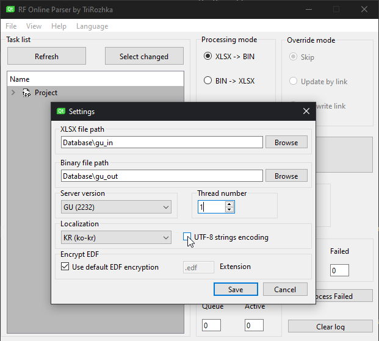

# ND File Localization with Parser [Sirin 0.26+] [Parser 1.0.0+]

> Games default localization files are `ND Files` NDItem.edf, NDQuest.edf, NDCharacter\
> `name` and `descriptions` of items, quests, monster names

>> Before Sirin 0.26+ and the c++ Parser 1.0.0+ the language support for these files were limited. Supporting only a select range of characters 

Note: a full license for the [C++ Parser [Discord]](https://discord.gg/PCBvHdbP8f) is required 

Setting UTF-8 encoding will ensure the output contains the data needed to display any language strings

#### Importing non UTF-8 (Default ND Files) ####

On importing `BIN->XLSX` if you are importing from default `NDFiles` uncheck this option during import.\
As the data in your files __Will not__ use the UTF-8 encoding.

> Importing non UTF-8 files with `UTF-8 encoding` checked will result in a crash