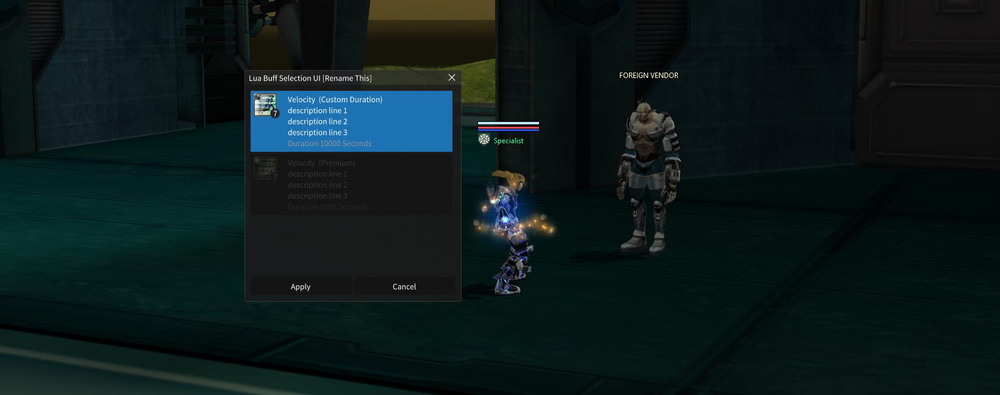

# NPC Buttons [Sirin 0.26+]

All files with the `.lua` file extension will be read as `NPC Buttons` in the `sirin-lua\NPCButtons` folder

>> NPC Buttons can be reloaded in game without restarting of the ZoneServer \
>> Using the GM command `%button reload`

```lua
[168] = {
	actionType = 1,
	clientName = {
		default = "Text For Button",
	},
	data = 1,
}, -- dont forget separating comma
```

> [168] = is the button index from `NPCharacter.xlsx` / `StoreList`. Each store has a maximum of 10 buttons

| Column  | Button Index   |
|---|---|
| NPCClass1  | 168 |
| NPCClass2  | 0 |
| ...  |  |
| NPCClass10  | 0 |

- First button index that does not exist in `GU is 164` and `AoP - 167`
- Highest button index that can be used is 255  
- Same button can be re-used on multiple npcs

> actionType
```lua
actionType = 1,
```
`Number` -- Button action to be used

| Value  | Action   |
|---|---|
| 0  | Custom lua function to be called from `Zoneserver\RF_Bin\luascript` [Adv use only]  |
| 1   | Exchange items using recipe from `ItemCombine.dat`/`Item.edf`  |
| 2   | Apply Buff(s) to the player |


> clientName
```lua
clientName = {
    default = "Text For Button",
    strRU = "Текст для кнопки"
},
```
`String` -- Text that is displayed on the button  [Additional languages can be set](scriptlocal)


> Data

#### Data will depend on `actionType` ####

> Data [actionType 0 | Custom function]
```lua
data = function(pPlayer) end,

```
`function` Custom function to be called

> Data [actionType 1 | Item Exchange]
```lua
data = 1,
```
`number` Index from `ItemCombine.dat`/`Item.edf` for item exchange

## NPC Buff Selection UI [Sirin 3.0+]




> Data [actionType 2 | Buffs]
```lua
[1] = {
	actionType = 2,
	clientName = {
		default = "Lua Buff Selection UI [Rename This]",
	},
	-- color = 0xFFE8E8E8, -- Optional color in ARGB format
	data = { -- list of buffs
		{
			skillType = 1, -- 0 - skill, 1 - force, 2 - class skill, 3 - bullet
			id = "8005", -- Dark velocity
			overrideExisting = false, -- optional allow to rebuff if already have same effect applied
			lv = 7, -- [1 to 7] 7 is GM
			durSec = 10000, -- optional duration
			description = { -- optional
				default = "(Custom Duration)\ndescription line 1\ndescription line 2\ndescription line 3",
			},
			conditions = { -- optional parameter. each of the following parameters are optional
				premiumUser = false,
				minLevel = 45,
				maxLevel = 55,
				rank = 0, -- [0 to 7] CPT rank
				item = {
					{
						code = "irjad01",
						consumeNum = 0, -- if 0 item must present but not consumed
					},
				},
				money = {
					currency = 0, -- 0 dalant, 1 gold, 2 pvp cash, 3 cpt, 4 processing point, 5 huncting point, 6 golden point
					value = 500,
				},
			}
		},
	},
}, -- dont forget trailing comma
}
```
> [1] = is the button index from `NPCharacter.xlsx` / `StoreList`. Each store has a maximum of 10 buttons

List of buffs each with their own optional conditions. Buff `id` can be found in

* Skill 		`Skill.dat`/`Skill.xlsx`
* Force 		`Force.dat`/`Force.xlsx`
* Class Skill 	`ClassSkill.dat`/`ClassSkill.xlsx`
* Bullet 		`BulletItemEffect.dat`/`BulletItemEffect.xlsx`

>> NPC buttons can be reloaded in game without restarting of the ZoneServer \
>> Using the GM command `%button reload`